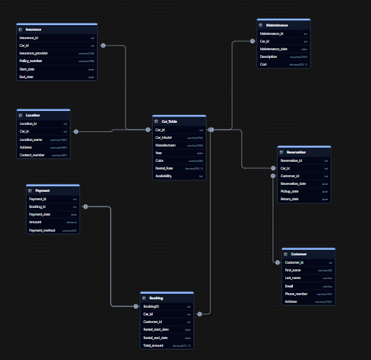

# Car Rental Management System

This repository provides an ER Diagram and SQL Server script for a Car Rental Management System.  
It demonstrates a complete relational database design, data integrity rules, and sample queries for managing car rentals.

## Entities

- Car
- Customer
- Booking
- Payment
- Insurance
- Location
- Reservation
- Maintenance

## Key Features

- Well-defined primary and foreign key relationships
- Data integrity enforced with UNIQUE and CHECK constraints
- Each table seeded with at least 5 sample records
- Example SELECT, UPDATE, and DELETE queries included

## Getting Started

1. Open SQL Server Management Studio.
2. Create a new database and execute the `rentaldb.sql` script.
3. Run queries like `SELECT * FROM Car;` to view sample data.

## Included Files

- `rentaldb.sql` – Contains all table definitions, sample data, and queries
- `Screenshot 2025-10-06 113004.png` – Visual ER Diagram of the database

## Author

Kiplangat22